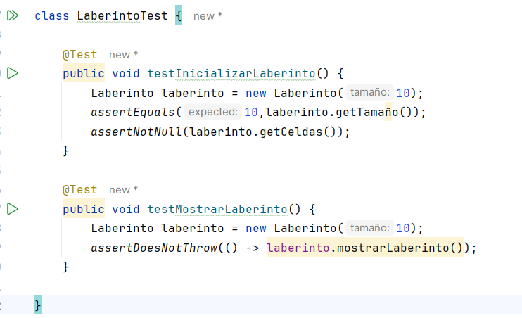

# Sprint 1

Empezamos utilizando TDD para el juego del laberinto

# Clase Laberinto

Partiremos creando las pruebas para la Clase `Laberinto`

Ejecutamos las pruebas

Vemos que no paso ninguna por lo que ahora se creara la clase Laberinto para hacer pasar las pruebas:

Logramos hacer pasar las pruebas que hicimos 

# Clase Jugador

Ahora partiremos creando las pruebas para la Clase `Jugador`

Ejecutamos las pruebas:

Vemos que no paso ninguna prueba por lo que ahora tocaria crear el codigo de la clase Jugador para hacer pasar las pruebas.

Ahora Ejecutemos las pruebas para ver si pasan 

Vemos que pasaron nuestras pruebas 

Ahora agregaremos nuevas pruebas para crear el metodo `verificarColisiones`:

Ahora ejecutemos las pruebas que creamos:

Vemos las 2 pruebas que creamos no pasan por que ahora refactorizaremos el codigo de la clase `Jugador` 

Ahora ejecutaremos las pruebas para ver que no hemos roto nada

Vemos que pasaron todas la pruebas por lo que esta bien implementado nuestra refactorizacion.

# Clase Juego

Ahora haremos las pruebas iniciales para la Clase `Juego`

 Ahora ejecutamos las pruebas:

Vemos que las pruebas no pasan.

Ahora haremos el codigo para que podamos hacer pasar la pruebas que hemos creado. 

Ahora ejecutaremos las pruebas para ver si pasan:

Vemos que nuestras pruebas pasaron 

Ahora creamos vamos a crear una prueba para crear el metodo `verificarEstadoDelJuego`.

Ejecutamos la prueba: 

Vemos que la prueba no pasa por lo que vamos que refactorizar las clases `Juego` , `Laberinto` y `Jugador` añadiendo las clases `VerificarEstadoDelJuego()`, `setCeldas()`, `setPosX()`y`setPosX()` respectivamente.

Ahora ejecutemos las pruebas para ver que no hemos roto nada

Vemos que todas las pruebas pasaron 

# Clase Salidas

Ahora crearemos la prueba para crear la Clase `Salidas` 

Ejecutamos las pruebas

Vemos que las pruebas no pasaron ahora crearemos la Clase `Salidas` para hacer pasar las pruebas.

Ahora ejecutemos otra ves las pruebas para ver si pasan 

Aca se acaba el Sprint 1