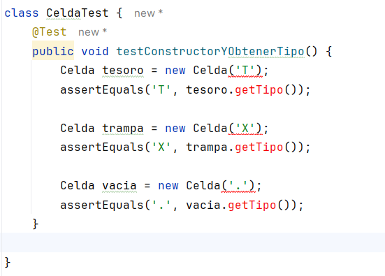

# Sprint2

# Clase Celda

Primero Empezamos creando la prueba para luego codear la Clase `Celda` 

Ejecutamos la prueba para ver si pasa:

La prueba esta en rojo por lo que ahora toca crear la clase `Celda` para hacer pasar estas pruebas:

Ahora ejecutemos la prueba para ver si logra pasar

Vemos que hemos logrado hacer pasar la prueba.

# Clase Laberinto

Ahora modificaremos esta clase para adicionarle los siguientes metodos `ColocarTesorosYTrampas()` y `ActualizarCelda()`

Ahora ejecutaremos las pruebas :

Vemos que las pruebas no pasan al ejecutarlas por lo que tendremos que hacer refactorizacion a la clase `Laberinto` 

Al hacer la refactorizacion hacemos los siguientes cambios:

- Usaremos la clase `Celda` como instancia para el atributo de celdas, el atributo `celdas` modificado lo agregamos al constructor.

||| eliminamos el metodo `getTamano()` ya que no es de utilidad.

- Haremos modificacion en los metodos `getCeldas()`, `setCeldas()` y `inicializarLaberinto()` para usar el atributo `celdas`/bo

- Ahora crearemos las clases para hacer pasar las pruebas

Ahora ejecutemos las pruebas para ver si logramos hacerlas pasar

Vemos que logramos hacer pasar las pruebas

# Clase Jugador

Ahora vamos a agregar nuevos metodos a esta clase para lo cual primero crearemos sus pruebas respectivas

 

Ahora haremos la refactorizacion de la clase Jugador para que pasen las pruebas para lo cual haremos los siguientes cambios

- Modificamos los siguientes metodos `actualizarPos()`, `mover()` para que sea mas sencillo de entender.

- Tambien modificaremos el metodo `verificarColisiones()` y crearemos el metodo `verificarTrampa()` que utilizara el metodo `perderVida()` mientras que el metodo `verificarColisiones()` utilizara la Clase `Celda` para hacer uso del metodo `getTipo().`
- 

- Ahora vamos a modificar a la clase recogerTesoro() para que utilice la clase Celda para usar el metodo getTipo().

Ahora con la refaztorizacion de la clase Jugador vamos a ejecutar las pruebas que creamos para ver si logran pasar y si no hemos roto nada.

# Clase Juego

Ahora añadiremos nuevos metodos a esta clase para lo cual primero tenemos que crear sus pruebas.

Modificaremos la prueba anterior de `testActualizarEstadoDelJuego()` y crearemos la prueba `testVerificarVictoriaODerrota()`

Ejecutamos las pruebas y veremos si pasan

Ahora haremos la refactorizacion de la clase `Jugador` para hacer pasar las pruebas.

Para lo cual modificaremos lo siguiente:

- Refactorizamos los metodos `iniciarJuego()` y `procesarComandos()` el primero para que pueda colocar los tesoros y las Trampas en el laberinto y luego colocar al jugador y el segundo para que en cada comando insertado se pueda actualizar el moviendo del Jugador al imprimir el laberinto.

- Refactorizamos el metodo `verificarEstadoDelJuego()` para dividirlo en 2 metodos uno que creamos `verificarVictoriaODerrota()` que nos dira cuando Ganamos o Perdimos el juego y el otro que usa el primer metodo para devolver false o true.

- Agregamos el metodo actualizarEstadoDelJuego() que nos dira si el juego sigue en proceso o a terminado.

 

Ahora ejecutamos las pruebas para ver que no hemos roto nada.

vemos que las pruebas han pasado porque la refactorizacion que hicimos esta bien

# Clase Salidas

Ahora vamos a añadir nuevos metodos a la clase `Salidas` y primero vamos a empezar por sus pruebas.

Ahora ejecutemos la prueba para ver si pasan

Vemos que las pruebas no pasan por lo que toca Refactorizar la Clase `Salidas` en la cual haremos los siguientes cambios:

- Añadimos los siguientes metodos para hacer pasar las pruebas

Ahora ejecutemos las pruebas para ver si pasan las pruebas y no hemos roto nada.

Vemos que todas las pruebas han pasado por lo que hicimos una correcta refactorizacion

Se acabo el Sprint 2