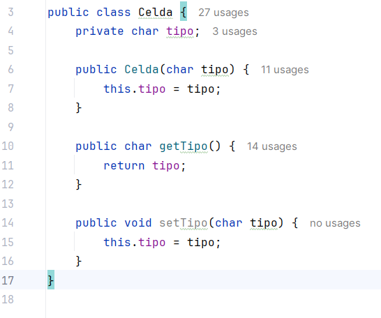

# Sprint 3

Ahora aplicaremos la inyeccion de Dependencias para el Juego

Modificamos las siguientes Clases

# Clase Celda

Hacemos las siguientes modificaciones

Agregamos un metodo `setTipo()` para colocar el tipo de una sola celda.

# Clase Laberinto

Hacemos las siguientes modificaciones

Modificamos la clase `mostrarLaberinto()` para imprimir el tipo de celda que es ya sea el del jugar de un tesoro o trampa.